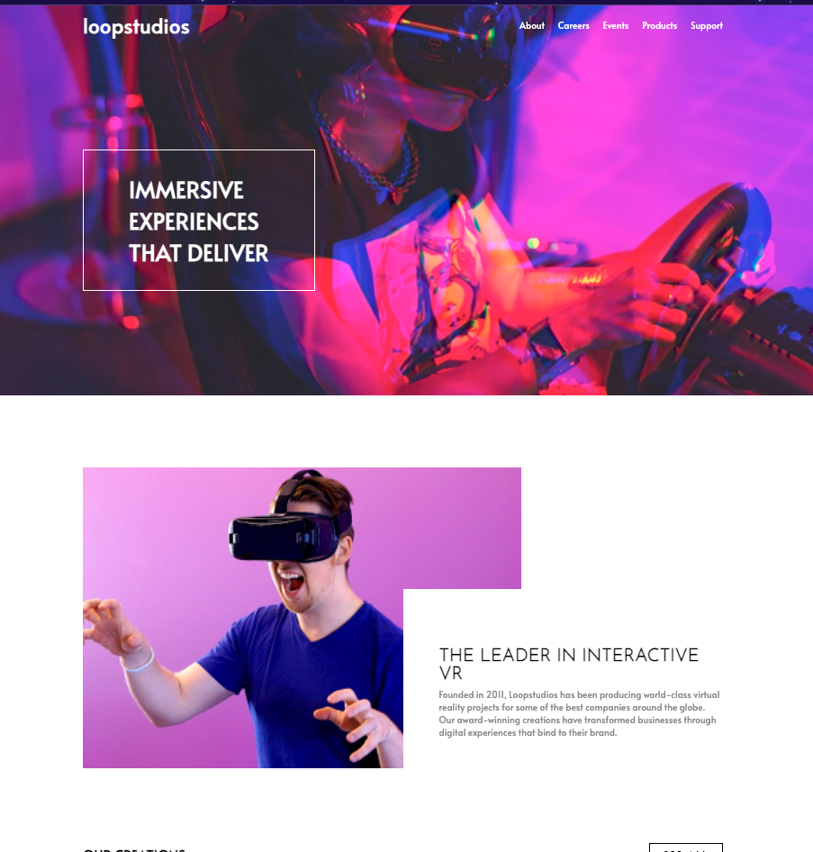

# Frontend Mentor - Loopstudios landing page solution
# Still in progress

Github Pages Link: https://eclecticowl.github.io/loopstudios-landing-page/

This is a solution to the [Loopstudios landing page challenge on Frontend Mentor](https://www.frontendmentor.io/challenges/loopstudios-landing-page-N88J5Onjw). Frontend Mentor challenges help you improve your coding skills by building realistic projects. 

## Table of contents

- [Overview](#overview)
  - [The challenge](#the-challenge)
  - [Screenshot](#screenshot)
  - [Links](#links)
- [My process](#my-process)
  - [Built with](#built-with)
  - [What I learned](#what-i-learned)

## Overview

### The challenge

Users should be able to:

- View the optimal layout for the site depending on their device's screen size
- See hover states for all interactive elements on the page

### Screenshot

## My process
- Desktop first workflow

### Built with
- HTML
- SASS (SASS)

### What I learned

I discovered the HTML picture element. I was trying my best to decide how to display a certain image on the page and this element allowed me to display them for different viewport widths. Though, in the future, I will have to take into consideration browser support for this element and start figuring out polyfills more. 